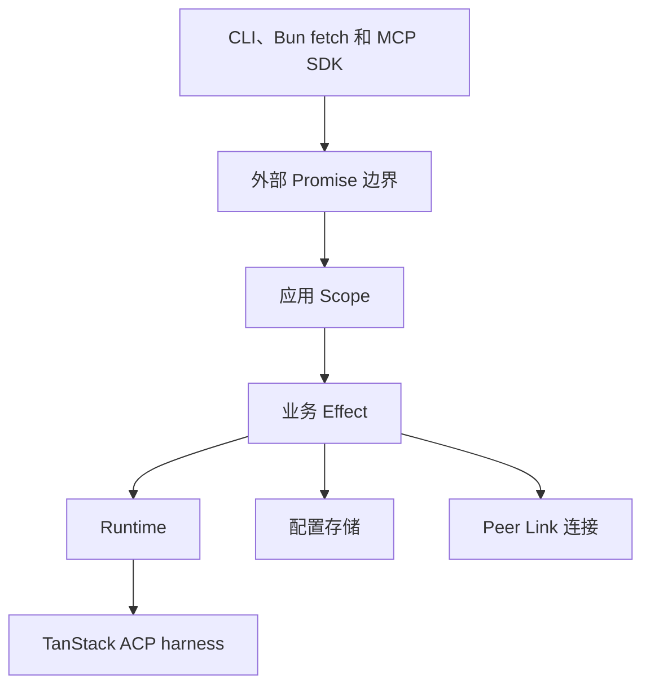

# Effect 控制面架构

Status: Implemented. 本文记录 TypeScript 控制面的 Effect 4 架构；产品合同见 `SPEC.md`。

## 依赖边界

- `effect@4.0.0-rc.112`：Effect、Schema、Scope、Fiber、Ref、Deferred、Semaphore、Duration。
- `@effect/platform-bun@4.0.0-rc.112`：Bun 文件系统、路径和子进程能力。
- `@effect/vitest@4.0.0-rc.112`：Effect 生命周期与服务测试。
- `effect/unstable/ai`：Node 与 Agent 的原生 MCP server、toolkit 和 Effect Schema 合同。
- `@modelcontextprotocol/sdk@1.29.0`：Peer Link 访问远端 Node 的 upstream MCP agent，以及黑盒兼容测试。
- `zod@4.1.12`：upstream MCP SDK 的必需 peer；项目源码不导入。

自有配置、binding、控制文件、上游响应和 transport 数据由 `apps/cli/src/schemas.ts` 中的 Effect Schema 解码。Go Tailcat transport 属于独立原生边界。

## 运行结构



Promise 只保留在 Bun fetch、Node fs/child_process、上游 MCP SDK、Effect HttpRouter web handler 和 CLI stdin 等真实外部 IO 边缘。业务 API 不保留 Promise 兼容入口、fallback 或双轨；调用方直接运行 Effect。

`qj serve` 持有一个根 `Scope`，内部启动 Node 与 Agent MCP surface。关闭根 Scope 会停止 reload Fiber、关闭 MCP、停止 Runtime/Peer、释放 process lock 和 server。模块内部状态使用 `Ref`，互斥和容量使用 `Semaphore`，请求 settlement 使用 `Deferred`，后台工作使用 scoped `Fiber`。

## 模块职责

| 模块                                                  | Effect 责任                                                              |
| ----------------------------------------------------- | ------------------------------------------------------------------------ |
| `config.ts`、`agent-config.ts`、`runtime/sessions.ts` | Schema 解码、私密文件读写、锁内更新与 binding 持久化                     |
| `private-files.ts`                                    | 私密目录、原子写入和 scoped 跨进程锁的直接 Effect 接口                   |
| `runtime/tanstack-acp.ts`                             | TanStack AI ACP harness、local process sandbox、prompt 和取消            |
| `runtime/tanstack-persistence.ts`                     | TanStack messages/runs 和 sandbox instance 的 file-backed stores         |
| `runtime/runtime-pool.ts`                             | 每 binding 串行、容量 reservation、后端复用、retirement 和 idle eviction |
| `runtime/coordinator.ts`                              | ask admission、lease、配置 reconciliation 和 binding 清理                |
| `peer-runtime.ts`                                     | Connector 与 upstream MCP 的 lazy verified session 和有序关闭            |
| `agent-application.ts`                                | 多 Peer reconciliation、隔离、lease 和路由                               |
| `mcp.ts`、`agent-mcp.ts`                              | Effect MCP server、认证、容量、session 生命周期和 Bun fetch 桥接         |
| `server.ts`、`agent-server.ts`                        | 根 Scope、reload Fiber、process lock、HTTP server 和关闭顺序             |

## 不变合同

- Agent-facing MCP 只公开 `list_peers()` 与 `ask({ peer, workspace, question })`。
- Node MCP 只公开 `list_workspaces()` 与 `ask({ workspace, question })`。
- 同一 `remote Peer credential + Workspace` 串行；不同 binding 可并发。
- Node Runtime 运行内置 Pi RPC 或配置的 ACP-compatible CLI。
- Runtime cancellation 会 abort 当前 turn 并等待 settle；TanStack ACP 通过 `AbortController` 取消 harness session 与本地 sandbox process；五秒未 settle 触发 fatal shutdown。
- 已被 Runtime 或远端 Node 接受的 `ask` 不重试。
- credential rotation 保留 Runtime Session ID；Peer revoke 和 Workspace remove 只删 binding，不删 backend state。
- Peer 的身份验证、失败、取消和 Runtime 历史彼此隔离。
- 公开错误码、MCP metadata、CLI 和 release 产物保持兼容。

## 资源所有权

| 资源                              | 所有者                  | 释放                                     |
| --------------------------------- | ----------------------- | ---------------------------------------- |
| TanStack ACP harness process      | TanStack local sandbox  | `AbortController` / sandbox process kill |
| Runtime turn                      | 单次 ask Fiber          | interruption 时取消 harness session      |
| Connector 与 upstream MCP         | Peer Link session Scope | 先关闭 MCP，再关闭 Agent 与 Connector    |
| Runtime/Peer worker               | Node/Agent 根 Scope     | interrupt、等待 settlement、关闭资源     |
| reload、MCP、server、process lock | 应用根 Scope            | 按协议顺序关闭                           |

清理必须有界。协议有顺序要求时使用顺序 finalizer；无依赖资源才并行释放。Effect interruption 在公开 Promise 边界映射回原 `AbortSignal.reason`，不泄漏 `FiberFailure`。

## 测试边界

`bun test` 保留 Bun/MCP 黑盒合同测试；Vitest + `@effect/vitest` 覆盖 Effect 服务、Scope、Fiber、取消和 Layer。`apps/cli/package.json` 的 `test` 脚本执行两组测试，避免 Vite SSR 模拟 Bun server 或 MCP transport。

验收命令：

```bash
bun run verify
bun run build:release all
```

## 明确不做

- 不以 `@effect/rpc` 替换 MCP。
- 不以 Effect HTTP server 替换 Bun listener；原生 MCP handler 仍挂在现有 Bun server、认证和容量边界后。
- 不重写 Go Tailcat transport。
- 不为纯函数或单一值创建 Service/Layer。
- 不改变重试、timeout、并发容量、错误码或清理策略。
