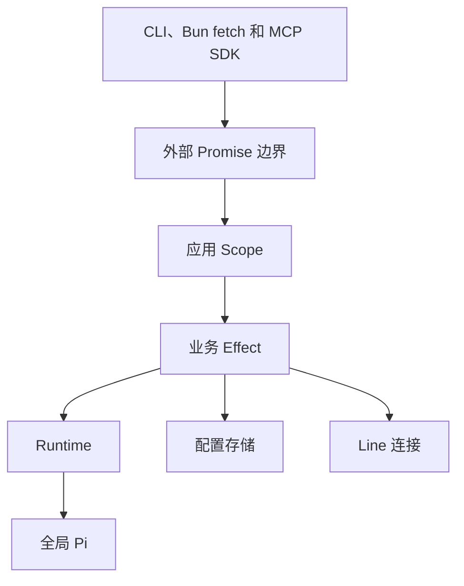

# Effect 控制面架构

Status: Implemented. 本文记录 TypeScript 控制面的 Effect 4 架构；产品合同见 `SPEC.md`。

## 依赖边界

- `effect@4.0.0-rc.112`：Effect、Schema、Scope、Fiber、Ref、Deferred、Semaphore、Duration。
- `@effect/platform-bun@4.0.0-rc.112`：Bun 文件系统、路径和子进程能力。
- `@effect/vitest@4.0.0-rc.112`：Effect 生命周期与服务测试。
- `effect/unstable/ai`：Gateway 与 Client 的原生 MCP server、toolkit 和 Effect Schema 合同。
- `@modelcontextprotocol/sdk@1.29.0`：Line 访问远端 Gateway 的 upstream MCP client，以及黑盒兼容测试。
- `zod@4.1.12`：upstream MCP SDK 的必需 peer；项目源码不导入。

自有配置、binding、控制文件、上游响应和 transport 数据由 `apps/cli/src/schemas.ts` 中的 Effect Schema 解码。Go Tailcat transport 不属于本次控制面迁移。

## 运行结构



Promise 只保留在 Bun fetch、Node fs/child_process、上游 MCP SDK、Effect HttpRouter web handler 和 CLI stdin 等真实外部 IO 边缘。业务 API 不保留 Promise 兼容入口、fallback 或双轨；调用方直接运行 Effect。

Gateway 与 Client server 各持有一个根 `Scope`。关闭根 Scope 会停止 reload Fiber、关闭 MCP、停止 Runtime/Line、释放 process lock 和 server。模块内部状态使用 `Ref`，互斥和容量使用 `Semaphore`，请求 settlement 使用 `Deferred`，后台工作使用 scoped `Fiber`。

## 模块职责

| 模块                                                   | Effect 责任                                                              |
| ------------------------------------------------------ | ------------------------------------------------------------------------ |
| `config.ts`、`client-config.ts`、`runtime/sessions.ts` | Schema 解码、私密文件读写、锁内更新与 binding 持久化                     |
| `private-files.ts`                                     | 私密目录、原子写入和 scoped 跨进程锁的直接 Effect 接口                   |
| `runtime/pi-rpc.ts`                                    | scoped Pi 子进程、JSONL 命令、turn settlement、取消和释放                |
| `runtime/pi-runtime.ts`                                | 每 binding 串行、容量 reservation、进程复用、retirement 和 idle eviction |
| `runtime/coordinator.ts`                               | ask admission、lease、配置 reconciliation 和 binding 清理                |
| `line-runtime.ts`                                      | Connector 与 upstream MCP 的 lazy verified session 和有序关闭            |
| `client-application.ts`                                | 多 Line reconciliation、隔离、lease 和路由                               |
| `mcp.ts`、`client-mcp.ts`                              | Effect MCP server、认证、容量、session 生命周期和 Bun fetch 桥接         |
| `server.ts`、`client-server.ts`                        | 根 Scope、reload Fiber、process lock、HTTP server 和关闭顺序             |

## 不变合同

- Agent-facing MCP 只公开 `list_lines()` 与 `ask({ line, workspace, question })`。
- Gateway MCP 只公开 `list_workspaces()` 与 `ask({ workspace, question })`。
- 同一 `remote Gateway Client + Workspace` 串行；不同 binding 可并发。
- Gateway 运行 Owner 的全局 Pi，不覆盖模型、认证、settings、tools、extensions、skills 或 session store。
- Pi RPC 使用严格 LF JSONL、command ID、`message_end` 和 `agent_settled`。
- 已接受 turn 的取消顺序为 `clear_queue -> abort -> agent_settled`；五秒未 settle 触发 fatal shutdown。
- 已被 Pi 或远端 Gateway 接受的 `ask` 不重试。
- credential rotation 保留 Pi session ID；Client revoke 和 Workspace remove 只删 binding，不删 Pi archive。
- Line 的身份验证、失败、取消和 Runtime 历史彼此隔离。
- 公开错误码、MCP metadata、CLI 和 release 产物保持兼容。

## 资源所有权

| 资源                              | 所有者                  | 释放                                   |
| --------------------------------- | ----------------------- | -------------------------------------- |
| 全局 Pi 子进程                    | Runtime Session Scope   | `SIGTERM`，一秒后 `SIGKILL`            |
| Pi turn                           | 单次 ask Fiber          | interruption 时执行完整取消序列        |
| Connector 与 upstream MCP         | Line session Scope      | 先关闭 MCP，再关闭 Client 与 Connector |
| Runtime/Line worker               | Gateway/Client 根 Scope | interrupt、等待 settlement、关闭资源   |
| reload、MCP、server、process lock | 应用根 Scope            | 按协议顺序关闭                         |

清理必须有界。协议有顺序要求时使用顺序 finalizer；无依赖资源才并行释放。Effect interruption 在公开 Promise 边界映射回原 `AbortSignal.reason`，不泄漏 `FiberFailure`。

## 测试边界

`bun test` 保留 Bun/MCP 黑盒合同测试；Vitest + `@effect/vitest` 覆盖 Effect 服务、Scope、Fiber、取消和 Layer。`apps/cli/package.json` 的 `test` 脚本执行两组测试，避免 Vite SSR 模拟 Bun server 或 MCP transport。

验收命令：

```bash
bun run verify
bun run build:release all
```

## 明确不做

- 不以 `@effect/rpc` 替换 MCP。
- 不以 Effect HTTP server 替换 Bun listener；原生 MCP handler 仍挂在现有 Bun server、认证和容量边界后。
- 不重写 Go Tailcat transport。
- 不为纯函数或单一值创建 Service/Layer。
- 不改变重试、timeout、并发容量、错误码或清理策略。
